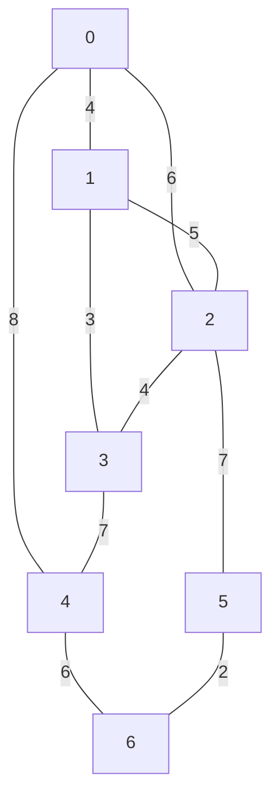
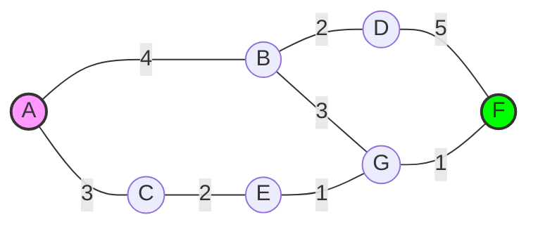

### Computatuion Math Challenges

**The strong number challenge**

Concept: verify if a number equals the sum of its digits's factorial.

```python
def is_strong_numner(n):
  digit_sum = sum(math.factorial(int(digit)) for digit in str(n))
  return digit_sum == n
```

**The Lucas Sequence Generator**

Concept: A variation of the Fibonacci sequence starting with L_0 = 2 and L_1 = 1.

output: finding the nth element

```python
def generate lucas(n_terms):
  lucas = [2, 1]
  while len(lucas) < n_terms:
    lucas.append(lucas[-1] + lucas[-2])
  return lucas
```

**Cryptarithmetic Solver**

```text
  C A T
+ A D D
--------
  T O Y
```

Each letter represent an unique digit from 0-9.

1. Analyze the hundred column (C + A = T or T0)
   - since the sum C + A yields a single digit T, the maximum C + A can be is 9 + 8 = 17. So T is 1 if there's a carry, or a digit from 0-9.
2. Analyze the unit column (T + D = Y or Y + 10)
   - T + D = Y or T + D = Y + 10 (generating a carry c1 to the tens column). c1 is either 0 or 1.
3. Analyze the tens column (A + D + c1 = O or O + 10)
   - A + D + c1 = 0 + 10*c2, where c2 is the carry to the hundreds column (0 or 1).
4. Analyze the hundreds column with carry: C + A + c2 = T
   - so, C + A + c2 = T
  
Let's test the most constrained part. Since C and A are leading digits, they are not 0. T is also a leading digit of the result.

Asume c2 = 1. Then C + A + 1 = T. Since C and A are at least 1, T is at least 1 + 1 + 1 = 3. This is plausible.

Now, for the tens column to generate a carry(c2=1), we need A + D + c1 >= 10.

T = 7. then C = 7 - A - 1 = 6 - A.
- А = 2. С = 4.

Tens: A + D = O + 9 -> 2 + D = O + 9 -> D = O + 7. O = 1. D = 8

Units: 7 + 8 = Y + 10 -> Y = 5

All distinct: A=2, C=4, T=7, D=8, O=1, Y=5.

Sum: CAT + ADD = 426 + 288 = 715. TOY = 715. So digits: C=4, A=2, T=7, D=8, O=1, Y=5. Sum = 4+2+7+8+1+5 = 27.
___

### Algorithm Analysis 

**Asymptotic Notation guide**

O(n) provies an upper bound, not a strict equality of steps.
- Big O (upper bound): the "worst-case" scenario;
- Big Omega (lower bound): the "best-case" scenario;
- Big Theta (tight bound): when the upper and lower bounds meet.

**Complexity tracker**

```python
def analyze_complexity(data_size):
  op_counter = 0

  # triple nested loop structure
  for x in range(data_size):
    op_counter += x
    for y in range(data_size):
      for z in range(data_size):
        op_counter += x

  # separate double nested loop
  for x in range(data_size):
    for y in range(data_size):
      op_counter += x

  return op_counter

# testing
for n in [10, 20, 30]:
  total_ops = analyze_complexity(n)
```

The code consists of two main blocks:
1. the triple nest: we have a loop for x, inside a loop for y, and inside that a loop for z. In big-O notation, nested loops are multiplicative. Since there are three levels of nesting dependent on n, this block performs approximately n^3 operations.
   - complexity: O(n^3)
2. the double nest: a seperate set of loops for x and y follows the first block. This performes n^2 operations.
   - complexity: O(n^2)

In asymptotic analysis, we only keep the highest-order team because it dominates the growth as n approaches infinity.

O(n^3) + O(n^2) = O(n^3)

**Binary Search Comparisons**

Given a sorted array of 16 elements: [1, 4, 9, 15, 19, 22, 28, 33, 40, 47, 52, 59, 66, 73, 85, 94]. How many comparisons are needed to find if the number 16 exists?
- step 1: check middle (index 7, value 33). 16 < 33, go left
- step 2: check middle of left half (index 3, value 15). 16 > 15, go right
- step 3: check middle of remaining (index 5, value 22). 16 < 22, go left
- step 4: check remaining (index 4, value 19). 16 not equals to 19. Search ends

Python implemantation
```python
def binary_search_count(arr, target):
  low = 0
  high = len(arr) - 1
  count = 0
  while low <= high:
    count += 1
    mid = (low + high) // 2
    if arr[mid] == target:
      return count
    elif arr[mid] < target:
      low = mid + 1
    else:
      high = mid - 1
  return count
```

**Matrix multiplication complexity**

1. For **square matrices** of size n x n the standard triple-loop algorithm requires approximately:
   - n^3 multiplications
   - n^3 additions
   - total: **O(n^3)** floating-point operations
  
2. For rectangular matrices p x q and q x r operation count:
  - multiplication = p * q * r,
  - additions = p * r * (q - 1)

3. Faster algorithms

Asymptotically better methods exist:
- Strassen's algorithm: O(n^2.81)
- modern algorithms (theoretical): down to O(n^2.373)


___

### Data Structures & Logic

**Array indexing**
- zero-based indexing: for an array of size N, the range is always 0 to N-1

**Representing logic**

The transition from natural language (algorithm steps) to pseudocode to source code.

**Huffman codding**

| Symbol | Frequency |
| :--- | :--- |
| **D** | 0.30 |
| **A** | 0.25 |
| **B** | 0.20 |
| **C** | 0.15 |
| **E** | 0.10 |

Perform Huffman coding. What is the binary encoding for the sequence C A B D?

- step 1: sort by frequency: E(0.10), C(0.15), B(0.20), A(0.25), D(0.30);
- step 2: combine smallest two (E, C) -> node (EC, 0.25). New list: B(0.20), A(0.25), EC(0.25), D(0.30);
- step 3: combine B(0.20) and A(0.25) -> node (BA, 0.45). List: EC(0.25), D(0.30), BA(0.45);
- step 4: combine EC(0.25) and D(0.30) -> node(ECD, 0.55). 
___

### Algorithm Design Theory

Concept: Algorithm characteristics to be valid, an algorithm must possess specific properties that ensure it can be executed reliably.
- definiteness (clarity): every step must be precisely defined and unambiguous;
- finiteness: the process must teminate after a countable number of steps;
- efficiency: the algorithm should use resoueces (time/memory) effectively.

Concept: Definition of an Algorithm
- "An algorithm is any well-defined computational procedure that takes some value, or set of values, as input and produces some value, or set of values, as output". Cormen, Thomas H., et al. Introduction to Algorithms. 3rd ed., The MIT Press, 2009.
- key distinction: while a program is the implementation, the algorithm is the logical sequence of steps itself.

Concept: Identifying which sorting algorithms achieve the optimal O(n log n) time complexity.
- O(n^2) algorithms: bubble sort and insertion sort;
- O(n log n) algorithms: heap sort and merge sort.

Concept: Heap Sort paradigm. To which algorithmic approach does Heap Sort belong?
- Heap Sort is an example of the Decrease and Conquer method. It transforms the input into a "heap" data structure and then repeatedly reduces the problem size by extracting the maximum/minimum element.

Concept: Examples of Decrease and Conquer approach
- Insertion Sort: consistently reduces the unsorted portion of the list by one element at a time;
- Binary Search: reduces the search space by half at each step.

```python
def insertion_sort(arr):
  for i in range(1, len(arr)):
    key = arr[i]
    j = i - 1
    while j >= 0 and key < arr[j]:
      arr[j + 1] = arr[j]
      j -= 1
    arr[j + 1] = key
  return arr
```

```python
def bubble_sort(a):
  n = len(a)
  for j in range(n-1, 0, -1):
    for k in range(j):
      if a[k+1] < a[k]:
        a[k], a[k+1] = a[k+1], a[k]
  return a
```


___

### Recursive computation

Challenge: combined recursive functions. This demonstrates how to calculate the sum of two different recursive mathematical sequences at a specific point n.
- function F(n) (Factorical): defined as n x F(n-1).
- function G(n) (Fibonacci): defined as G(n-1) + G(n-2)
- solution: F(n) + G(n)

___

### Algorithm Optimization Strategies

Concept: A Greedy approach makes the best local choice at each step without reconsidering previous decisions.
- local optimum: it focuses on the immediate best result;
- irreversibility: once a choice is made, it is never reversed;
- selection vs. systematic search: it does not try every possible solution (which would be Brute Force); it follows a specific heuristic;
- real-world examples: selection sort and huffman codding.

Concept: Which method is most commonly used to solve complex optimization problems?
- Dynamic Programming is the standard approach for finding the best possible solution in scenarious with overlapping subproblems.

Concept: principles of dynamic programming

Dynamic Programming is a method for solving complex problems by breaking them down into simpler subproblems.
- statement 1: DP avoids re-solving subproblemsby storing their results in a table (memoization);
- statement 2: DP algorithms often trade memory space to gain significant time efficiency;
- statement 3: decisions are made at each step to reach the optimal solution.


**Challenge: The Knapsack problem**

A comparison of the Greedy approach vs. Dynamic Programming. 10 kg capacity with items of varying weights and values.

Greedy logic: always picks the highest value-per-kg first.
```python
def greedy_knapsack(capacity, items):
  sorted_items = sorted(items, key=lambda x: x['value']/x['weight'], reverse=True)
  total_value = 0
  current_weight = 0

  for item in sorted_items:
    if current_weight + item['weight'] <= capacity:
      current_weight += item['weight']
      total_value += item['value']

  return total_value
```

Dynamic Programming logic: finds the absolute mathematical maximum.
```python
def dp_knapsack(capacity, items):
  n = len(items)
  dp = [[0 for _ in range(capacity + 1)] for _ in range(n + 1)]

  for i in range(1, n+1):
    item_w = items[i-1]['weight']
    item_v = items[i-1]['value']
    for w in range(capacity + 1):
      if item_w <= w:
        dp[i][w] = max(dp[i-1][w], dp[i-1][w - item_w] + item_v)
      else:
        dp[i][w] = dp[i-1][w]

  return dp[n][capacity]
```

### Graph Theory & Optimization


Challenge: Minimum Spanning Tree - Prim's algorthm

Prim's MST starting from node 0. Step-by-step construction:
- step 0: S={0}, candidate edges: 0-1(4), 0-2(6), 0-4(8). Pick 0-1 with weight 4;
- step 1: S={0, 1}, candidates: 0-2(6), 0-4(8), 1-2(5), 1-3(3). Pick 1-3 with weight 3;
- step 2: S={0, 1, 3}, candidates: 0-2(6), 0-4(8), 1-2(5), 2-3(4), 3-4(7). Pick 2-3 with weight 4;
- step 3: S={0, 1, 3, 2}, candidates: 0-4(8), 2-5(7), 3-4(7). Pick 3-4 with weight 7;
- step 4: S={0, 1, 3, 2, 4}, candidates: 0-4(8), 2-5(7), 4-6(6). Pick 4-6 with weight 6;
- step 5: S={0, 1, 3, 2, 4, 6}, candidaates: 2-5(7), 5-6(2). Pick 5-6 with weight 2;
- step 6: S={0, 1, 3, 2, 4, 6, 5} - all vertices included.

MST edges: 0–1(4), 1–3(3), 2–3(4), 3–4(7), 4–6(6), 5–6(2)

Total weight: 26

Both 0-2 and 0-4 are not in MST. 



```python
import heapq

def prim_mst(graph, start_node):
  mst_weight = 0
  visited = set()
  min_heap = [(0, start_node)]

  while min_heap:
    weight, u = heapq.heappop(min_heap)
    if u in visited:
      continue

    visited.add(u)
    mst_weight += weight

    for v, w n graph[u]:
      if v not in visited:
        heapq.heappush(min_heap, (w, v))

  return mst_weight

graph_data = {
    0: [(1, 4), (2, 6), (4, 8)],
    1: [(0, 4), (2, 5), (3, 3)],
    2: [(0, 6), (1, 5), (3, 4), (5, 7)],
    3: [(1, 3), (2, 4), (4, 7)],
    4: [(0, 8), (3, 7), (6, 6)],
    5: [(2, 7), (6, 2)],
    6: [(4, 6), (5, 2)]
}
```

Challenge: given the weighted graph below, find the shortest path from A to F and list the sequence of nodes.

Shortest path cost A -> F = 7

Path: A(0) -> C(3) -> E(5) -> G(6) -> F(7)


